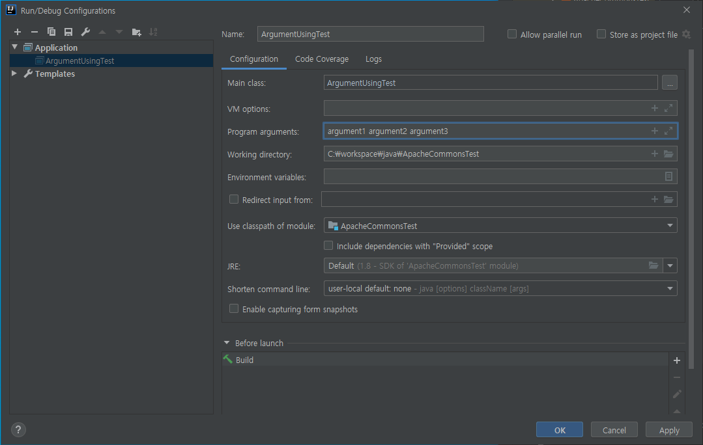
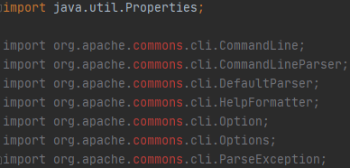
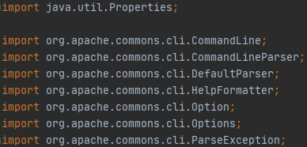

# Apache-commons CLI
* 자바 프로젝트 진행 시, 주로 IDE 환경 내에서 실행한다. 
* 하지만 명령행 인자를 필요로 하는 프로그램의 경우 따로 설정해주어야 한다.
* Run 툴바 - edit Configurations 탭 - Program arguments 에 인자를 넣어 실행



<br/>

* 실제 배포하여 서버에서 실행 할 때는 리눅스 환경 즉, 커널에서 수행하는 경우가 많다.

* 이 때 다음과 같이 인자를 주는 방법으로 수행하곤 한다.

  * ```
    java -jar ArgumentProgram.jar argument1 argument2 argument3
    ```

* 하지만 각종 파라미터로 옵션들을 처리할 경우가 많은 경우, 순서가 헷갈리거나 옵션을 잘못 넣는 경우가 생겨 문제가 발생할 수도 있다.

* 이를 위해 Apache Software Foundation에서 Open source로 만든 라이브러리인 Commons CLI를 사용해, Commend 옵션들을 효율적으로 처리할 수 있다.

<br/>

### 프로젝트에 적용하기

* [Apache commons CLI 다운로드](https://search.maven.org/artifact/commons-cli/commons-cli/1.4/jar)
* 해당 링크에서 Downloads를 통해 jar파일 등으로 받거나, Maven의 경우 \<dependency>, Gradle의 경우 implementation 해주는 경로 및 형식을 제공한다.
* 우선 기존의 Gradle 프로젝트에 적용이 아닌 이것만 테스트 해볼 용도로 진행하는 것이므로 jar로 받았다.
* library에 해당 commons-cli-1.4.jar 파일을 추가시켜준다.



* 위와 같은 찾을 수 없던 오류가, 추가한 즉시 아래와 같이 바뀐 것을 확인할 수 있다.



<br/>

<br/>

### 처리 단계

* command line을 처리하는 과정은 정의(Definition), 파싱(Parsing), 질의(Interrogation) 단계로 나뉜다.

<br/>

### 정의 단계

* 인자로 전달하는 옵션들의 정의를 위해 Options를 (Options의 인스턴스를) 정의하는 단계이다.
* CLI는 Options class를 Option 인스턴스들의 컨테이너로 사용한다.
* Option을 생성하는 방법에는 생성자를 통하는 것, Options의 팩토리 메서드를 통하는 방법 두 가지가 있다.

<br/>

### 파싱 단계

* 응용프로그램에 command line으로 전달된 문장을 처리하기 위한 단계이다.
* CommandLineParser 인터페이스에 정의된 parse 메소드는 Options 인스턴스와 args를 인자로 가진다.
* 구현체는 여러개가 있지만, new DefaultParser()를 통해 CommandLine 객체를 반환하는 것을 권장한다.
* 이 단계에서 수행되는 결과는, CommandLine 인스턴스이다.

<br/>

### 질의 단계

* 응용프로그램이 CommandLine으로 부울 옵션과 옵션 값들에 따라 수행할 작업을 결정하는 단계이다.
* 즉, 이 단계에서 옵션별로 수행되는 기능을 사용자가 직접 구현하면 된다.

<br/>

<br/>

### 사용 예시

#### 부울 옵션 사용

* 옵션이 발견되면 옵션 값이 true, 그렇지 않으면 값이 false이다.

<br/>

#### 옵션 만들기

```java
// Options 객체 생성
Options options = new Options();

// 생성자를 이용한 객체 생성
Option op = new Option("op");
// t 옵션 추가, 추가 인자 없음
options.addOption("t", false, "현재 시간 표시");
// c 옵션 추가, 추가 인자 있음
options.addOption("c", true, "country code");

// 팩토리 메소드를 이용한 Option 객체 생성 및 추가
options.addOption(Option.builder().longOpt("t").desc("-t option").hasArg(false).build());
options.addOption(Option.builder().longOpt("c").desc("-c option").hasArg(true).build());
```

<br/>

#### Command line 인자 분석

```java
// CommandLineParser 인터페이스 구현체의 객체 parser 생성
CommandLineParser parser = new DefaultParser();
try {
    // options, args를 인자로 준 parse 메소드로 CommandLine 객체를 반환
	CommandLine cmd = parser.parse(options, args);
    
    if (cmd.hasOption("t")) {
		...
    } else if (cmd.hasOption("c")) {
    	...
    }
    
} catch (ParseException e) {
	new HelpFormatter().printHelp("Sample CLI", options);
	e.printStackTrace();
}
```

* CommandLineParser : 보통 구현체 객체를 반환하는 new DefaultParser()를 많이 사용한다.
* CommandLine : 설정한 옵션을 담은 options와, 실행시 인자로 함께 받은 args를 넘겨 파싱을 수행한다.
  * 이 때, option에 포함되는 옵션 인자가 존재하지 않으면 에러를 발생한다.
* hasOption("") : 인자에 해당하는 옵션이 존재하는지 여부를 반환하는 함수이다.
* HelpFormatter().printHelp("",_) : 안내 메시지와 options에 해당하는 옵션 인자, description을 출력해준다.

<br/>

#### Option.setArgs()

* Option이 가질 수 있는 argument value의 개수를 설정하는 함수이다.
* 해당 옵션의 추가 인자가 몇 개 인지 모를 경우에 사용할 수 있다.
* 설정하는 방법은 다음과 같다.

```java
Option p = new Option("p");
p.setArgs(Option.UNLIMITED_VALUES);
```

<br/>

* 이미 Options에 들어가 있는 것을 설정하려면 다음과 같이 해주면 된다.

```java
options.addOption(Option.builder().longOpt("t").desc("-t option").hasArg(false).build());

options.getOption("t").setArgs(Option.UNLIMITED_VALUES);
```

<br/>

<br/>


